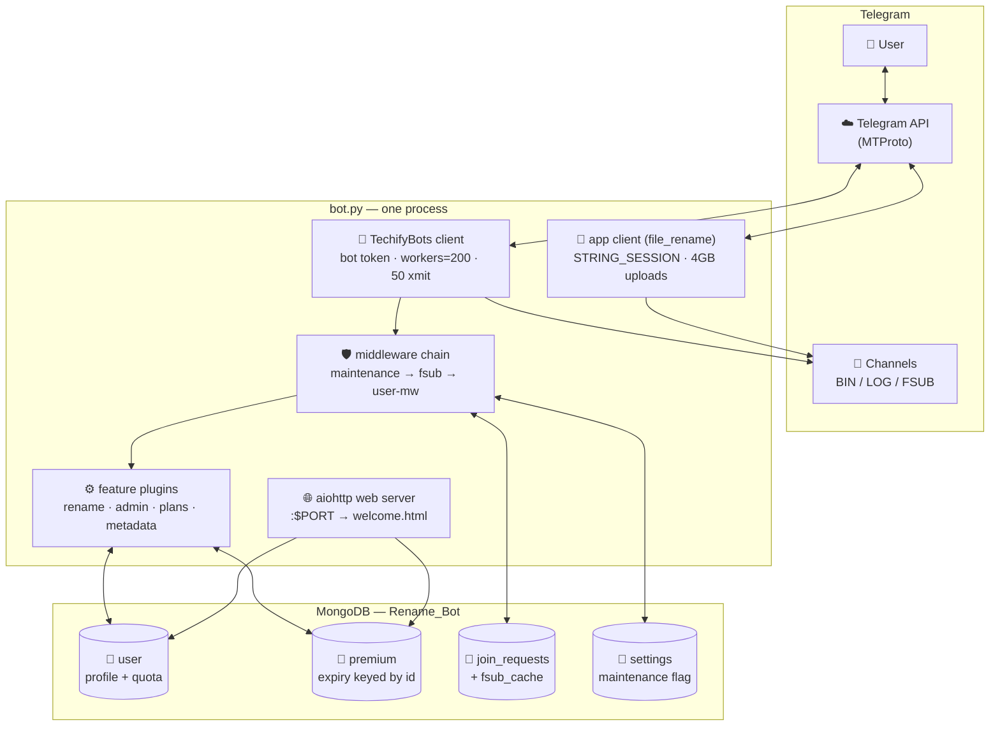
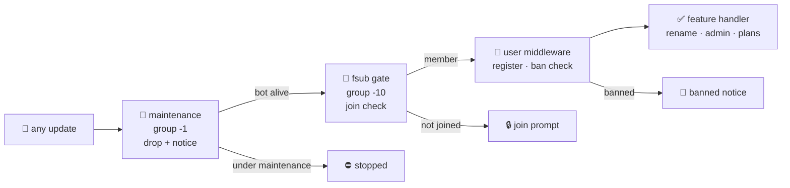
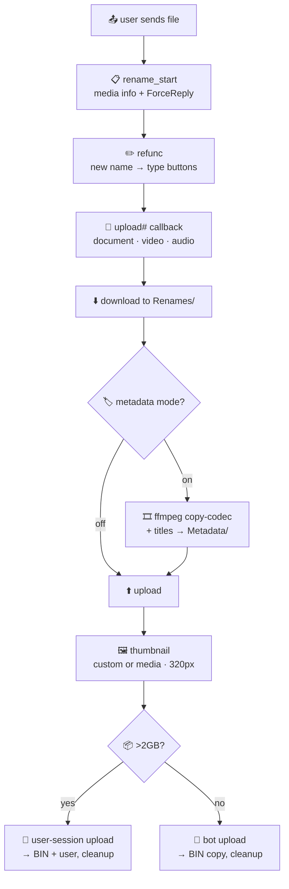
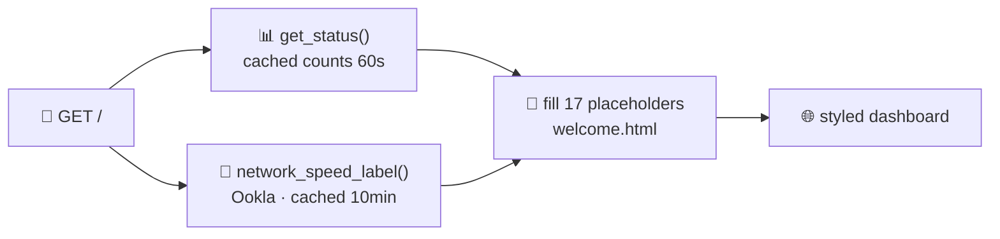

<div align="center">


<p align="center">

A **powerful, open-source, and feature-rich** Telegram bot designed to **rename, customize, and transform files effortlessly** with support for **custom thumbnails, metadata, captions, and video conversion**.

⚡ Fast • 📝 Flexible • 🖼️ Customizable

</p>


[](https://github.com/TechifyBots/Rename-Bot/commits)
<br>
[](https://github.com/bisug/Rename-Bot/actions/workflows/ci.yml)
[](https://github.com/bisug/Rename-Bot/actions/workflows/codeql.yml)
<br>
[](https://github.com/TechifyBots)
[](https://github.com/TechifyBots/Rename-Bot/fork)
<br>
[](https://github.com/TechifyBots/Rename-Bot)

</div>

<p align="center">
  
</p>

## 📑 Table of Contents

- 🌸 **[Overview](#-overview)**
- 🏗️ **[Architecture](#-architecture)**
- 🛠️ **[Tech Stack](#-tech-stack)**
- ✨ **[Features](#-features)**
- 🎥 **[Quick Start](#-quick-start)**
- ⚙️ **[Configuration](#-configuration)**
- 🤖 **[Commands](#-commands)**
- 🚀 **[Deployment](#-deployment)**
- 🤝 **[Contributing](#-contributing)**
- 📄 **[License](#-license)**
- 💬 **[Updates & Support](#-updates--support)**
- 🙌 **[Credits](#-credits)**
- 👨‍💻 **[Connect With Me](#-connect-with-me)**

---

## 🌸 Overview

**Rename Bot** is a powerful Telegram file management bot that goes **far beyond simple renaming**. It combines **4GB file support, premium plans, thumbnails, metadata, captions, and file conversion** into one convenient Telegram-based workflow.

> 💡 *Take full control of your files with powerful customization tools.*

### 🤔 Why Choose This Project?

- ⚡ **Fast & Powerful** — Process and rename files quickly with support for large files.
- 🎨 **Highly Flexible** — Customize your files with powerful options tailored to your needs.
- 💎 **Premium Ready** — Built-in plans and premium features for enhanced capabilities.
- 🚀 **Easy to Deploy** — Ready for self-hosting across multiple popular platforms.

### 🔄 How It Works

1. 📤 **Send Your File** — Upload the file you want to rename or process.
2. ⚙️ **Choose Your Options** — Configure your filename and preferred customization settings.
3. 🔄 **Let the Bot Process** — The bot applies your selected settings automatically.
4. 📥 **Get the Result** — Receive your customized file back through Telegram.

---

## 🏗️ Architecture

### Runtime overview



Two Telegram clients share the process: the main bot client handles all commands, and an optional user-session client (`STRING_SESSION`) uploads files >2GB. The aiohttp status page lives in the same process on `$PORT`.

### Request pipeline (Pyrogram handler groups)



Earlier groups run first and `StopPropagation` halts the chain — maintenance blocks everything (except bypass IDs), force-subscribe blocks non-members, banned users never reach features.

### Rename flow



Downloads land in `Renames/`, metadata rewrites in `Metadata/`, every path is cleaned via `remove_path`. Premium daily quota is reserved before download and refunded on failure.

### Web status page



### Tech visuals

<p align="center">
  <a href="https://skillicons.dev">
    
  </a>
</p>

<p align="center">
  
  
  
  
  
</p>

---

## 🛠️ Tech Stack

| Layer | Technology | Version | Role |
|:------|:-----------|:--------|:-----|
| Language | Python | **3.14.7** (`python:3.14-slim` in Docker) | Async runtime, pinned in `.python-version` |
| Telegram | Kurigram (+ TgCryptoRust) | `2.2.26` / `1.3.1` | Pyrogram fork — bot + user-session clients, `workers=200` |
| Web | aiohttp | `3.14.3` | Status dashboard (`/`, 17-placeholder template) |
| Database | MongoDB (`pymongo` AsyncMongoClient) | `4.18.1` | `user` (profile + quota) · `premium` (expiry keyed by `id`, indexed) · `join_requests` · `fsub_cache` · `settings` — one shared client |
| Media | ffmpeg / ffprobe | system (Docker-baked) | Duration probe, copy-codec metadata rewrite, 320px thumbnails (`Pillow 12.3.0`) |
| Loop | uvloop | `0.22.1` | Fast event loop, stdlib fallback |
| Metrics | psutil + Ookla speedtest | `7.2.2` | CPU/RAM/disk + live network label (10-min cache) |
| Config | python-dotenv | `1.2.3` | 14 env vars (`config.py` ↔ `app.json` ↔ `render.yaml`, CI-checked) |
| CI/CD | GitHub Actions + CodeQL + Dependabot | — | `build` · `audit` · `validate` gates, weekly CodeQL + pip updates |
| Deploy | Docker · Heroku · Render · Koyeb/Railway | — | `Dockerfile` · `app.json` · `render.yaml` in repo |

> Single-process design: bot + optional 4GB user client + web server share one event loop and one Mongo client — no inter-service wiring, `SIGINT/SIGTERM` graceful shutdown.

---

## ✨ Features

- ⚡ **Fast File Renaming** — Rename files quickly with an efficient Telegram-based workflow.
- 📦 **4GB File Support** — Process large files with upgraded 4GB support.
- 💎 **Premium Plans** — Offer upgraded limits and premium capabilities for users.
- 🖼️ **Thumbnail Customization** — Set permanent custom thumbnails for your files.
- 📝 **File Customization** — Personalize filenames, captions, prefixes, suffixes, and metadata.
- 🔄 **File Conversion** — Convert supported files between video and document formats.
- ♾️ **Unlimited Renaming** — Rename multiple files without a fixed renaming limit.
- 📢 **Broadcast System** — Send announcements and updates to all registered users.
- 🔐 **Force Subscribe** — Require users to join configured channels before using the bot.
- 🛡️ **User Management** — Ban, unban, and manage users directly from the bot.
- 🔧 **Maintenance Mode** — Temporarily pause bot services whenever maintenance is required.
- 🚀 **Multi-Platform Deployment** — Deploy easily on Koyeb, Heroku, Railway, and Render.

---

## 🎥 Quick Start

New to this project?

Watch this short video to understand **what the bot is**, **why it's useful**, **how it works**, explore its **key features**, and learn the **required configuration** before deployment.

📺 **Watch on YouTube: *[Project Overview](https://youtu.be/9q77WrKnm9k)***

---


## 📝 Configuration

| Variable | Description |
|:---------|:------------|
| `API_ID` | Telegram API ID |
| `API_HASH` | Telegram API Hash |
| `BOT_TOKEN` | Telegram Bot Token |
| `DB_URL` | MongoDB URI |
| `DB_NAME` | MongoDB database name *(default: `Rename_Bot`)* |
| `ADMIN` | Telegram User ID |
| `PIC` | Start image URL |
| `BIN_CHANNEL` | Bin Channel |
| `IS_FSUB` | Enable / Disable Force Subscribe |
| `FSUB_EXPIRE` | Force Subscribe Expire Time |
| `AUTH_CHANNELS` | Force Subscribe Channels |
| `AUTH_REQ_CHANNELS` | Request FSUB Channels (membership verified live) |
| `LOG_CHANNEL` | Log Channel |
| `STRING_SESSION` | Session string required for 4GB file processing |
| `PORT` | Web server port *(default: `8080`)* |

### 📝 Notes

> 💎 **4GB Support** — `STRING_SESSION` is **optional**. Add a **Kurigram v2 String Session** (Pyrogram-compatible) to enable 4GB file processing.

> ⚠️ **Without `STRING_SESSION`**, the bot will continue to work with its standard file-size limit.

### 📚 Setup Guides

- 🔑 **Telegram API ID & API Hash** — [Watch Tutorial](https://youtu.be/y5FwAobQ-Kc)
- 🤖 **Bot Token** — [Watch Tutorial](https://youtu.be/rUEKDOSPFho)
- 🍃 **MongoDB Database** — [Watch Tutorial](https://youtu.be/j8LIuM7vv18)

---

## 🤖 Commands

<details>
<summary><b>👤 User Commands</b></summary>

```
start - Check Bot Alive.
setprefix - Set Your Prefix
seeprefix - See Your Prefix
delprefix - Delete Your Prefix
viewthumb - To View Current Thumbnail.
delthumb - To Delete Current Thumbnail.
setcaption - To Set A Custom Caption.
seecaption - To See Your Custom Caption.
delcaption - To Delete Custom Caption.
setsuffix - Set Your Suffix
seesuffix - See Your Suffix
delsuffix - Delete Your Suffix
plans - to check all available plans.
myplan - to check your active plan.
metadata - To set custom metadata.
```

</details>

<details>
<summary><b>🔒 Owner Commands</b></summary>

```
ban - ban a user.
unban - unban a user.
banned - list all banned users.
status - get bot statistics.
broadcast - Send message to users.
logs - get recent bot logs.
addpremium - add a user to premium
removepremium - remove a user from premium
restart - restart the bot.
maintenance - Toggle maintenance mode.
delreq - Clear pending force-subscribe join requests.
```
</details>


<p align="center">
  
</p>

## 🚀 Deployment

Need help deploying this project? We've got you covered.

> [!TIP]
> 📺 **Complete Deployment Playlist** — Follow the step-by-step video tutorials to get started.
>
> **▶ [Watch on YouTube](https://www.youtube.com/playlist?list=PLQrMSile4s5UnIEvWyKM1MKFuNg8Wfh2S)**

### Prerequisites

- Python **3.14.7** (see `.python-version`; Docker uses `python:3.14-slim`)
- [ffmpeg](https://ffmpeg.org/download.html) on `PATH` (metadata + thumbnails; `ffprobe` too)
- MongoDB database (URI for `DB_URL`)
- Telegram `API_ID` / `API_HASH` / `BOT_TOKEN`, plus `ADMIN` user ID

### Run locally

```bash
pip install -r requirements.txt
export API_ID=… API_HASH=… BOT_TOKEN=… ADMIN=… DB_URL=mongodb://localhost:27017 LOG_CHANNEL=…
python bot.py
```

### Deploy targets (all wired in this repo)

| Platform | File | Notes |
|:---------|:-----|:------|
| Docker (any host) | `Dockerfile` | `ffmpeg` + Ookla speedtest baked in; `CMD ["python", "bot.py"]` (`bot.py` entrypoint) |
| Heroku | `app.json`, `Procfile`, `heroku.yml` | One-click via `app.json`; all 14 env vars declared |
| Render | `render.yaml` | Free web service, `autoDeploy: false`; all 14 env vars declared |
| Koyeb / Railway | `Dockerfile` | Deploy from repo, use the Docker builder, set env vars below |

### Required environment variables

All 14 are declared in `app.json` and `render.yaml` (CI's `validate` job fails the PR if they drift from `config.py`):

`API_ID` · `API_HASH` · `BOT_TOKEN` · `DB_URL` · `DB_NAME` · `ADMIN` · `PIC` · `BIN_CHANNEL` · `LOG_CHANNEL` · `STRING_SESSION` · `IS_FSUB` · `AUTH_CHANNELS` · `AUTH_REQ_CHANNELS` · `FSUB_EXPIRE` · (`PORT` is injected by the host, default `8080`)

> 💎 **4GB Support** — `STRING_SESSION` is **optional**. Add a **Kurigram v2 String Session** (Pyrogram-compatible) to enable 4GB file processing. Without it the bot keeps its standard 2GB limit.

### CI — what runs before deploy

Every push/PR runs [`.github/workflows/ci.yml`](.github/workflows/ci.yml) (badge ↑ top):

| Job | What it catches |
|:----|:----------------|
| `build` | Syntax errors (`compileall`), bug-class lint (`ruff F,E9`), plugin wiring (38 handlers + web routes smoke test) |
| `audit` | Known CVEs in `requirements.txt` (`pip-audit`, advisory) |
| `validate` | `config.py` ↔ `app.json` ↔ `render.yaml` env drift · unparseable manifests · Docker base ≠ `.python-version` · stale `welcome.html` placeholders · hardcoded secrets / committed session files |
| CodeQL | Python security analysis (weekly + per-push, [config](.github/workflows/codeql.yml)) |


---

## 🤝 Contributing

*Contributions are always appreciated! ❤️*

| 🐞 **Report Bugs** | 💡 **Suggest Features** | 🚀 **Submit PRs** |
|:------------------:|:-----------------------:|:-----------------:|
| Found an issue? | Have an idea? | Ready to contribute? |
| **[Open Issue](https://github.com/TechifyBots/Rename-Bot/issues)** | **[Open Discussion](https://github.com/TechifyBots/Rename-Bot/issues)** | **[Fork & Submit](https://github.com/TechifyBots/Rename-Bot/fork)** |

> [!IMPORTANT]
> *Before opening an issue, please ensure you're using the **[latest version](https://github.com/TechifyBots/Rename-Bot)** and have followed the **[deployment guide](https://www.youtube.com/playlist?list=PLQrMSile4s5UnIEvWyKM1MKFuNg8Wfh2S)**.*

---

## 📄 License

<p align="center">
  <a href="./LICENSE">
    
  </a>
</p>

> [!WARNING]
> *This project is intended **strictly for educational purposes only**. The author is **not responsible** for any misuse or abuse. Please comply with all applicable laws and the terms of any third-party services. If you modify or redistribute this project, please provide proper credit to the original repository.*

See the **[LICENSE](./LICENSE)** file for complete details.

---

## 🫂 Updates & Support

<div align="center">

<a href="https://telegram.me/TechifyBots"></a>
<br>
<a href="https://telegram.me/TechifySupport"></a>

</div>

---

## 🙌 Credits

This repository is based on the original work of:

- **Original Developer:** [DigitalBotz](https://github.com/DigitalBotz)

> [!NOTE]
> This repository is maintained by **TechifyBots**, with improvements to the project presentation and user experience.

<p align="center">
  
</p>

## 👤 Connect With Me

<p align="center">
  <b style="font-size: 5.5em;">Rahul Dhankhar</b>
  <br/>
  <sub><i>Open Source Maintainer • TechifyBots</i></sub>
<br/><br/>
<a href="https://github.com/TechifyBots"></a>
<a href="https://telegram.me/ImRahulDhankhar"></a>
<a href="https://instagram.com/ImRahulDhankhar"></a>
<a href="https://youtube.com/@TechifyBots"></a>
<br>
<a href="https://techifybots.github.io/PayWeb">
  
</a>
</p>